## 👋 Hello! You've found my profile!

I'm a 13 year old game developer/pixel artist in training. I'm most fluent in  JavaScript. My favorite animal is an owl 🦉, hence my website. Most of my games are made in JavaScript, but I've used Godot and Unity too. For art I use [Aseprite](https://aseprite.org). Hope you like my games.

[Take me on an adventure 🧭](adventure/start.md)

## Links
Website: https://mageowlstudios.com 
Scratch profile: [@seattleowl](https://scratch.mit.edu/users/seattleowl)
Itch profile: [@mageowl](https://mageowl.itch.io)

#### 🦉 <- This is Aaron. He watches my profile for me.
